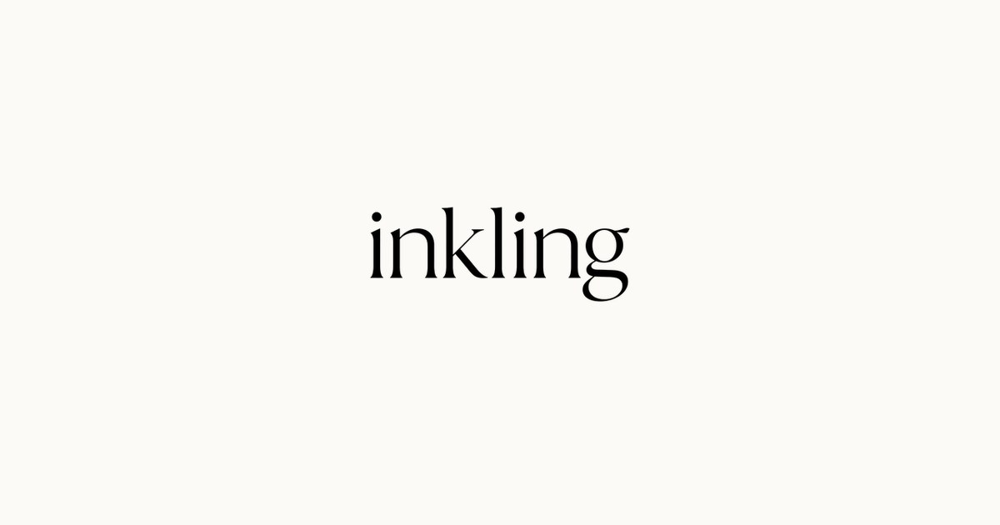

<p align="center"></p>
<p align="center"><em>free intelligence for all</em></p>
<p align="center">Say hello: <a href="mailto:hello@inkling.free">hello@inkling.free</a></p>
<p align="center"><a href="https://buymeacoffee.com/inklingfree"></a></p>

# inkling

A personal assistant that lives in WhatsApp, for you and a few friends. You text it the way you'd text a friend, on
your own or in a group chat, and it texts back. Each person gets their own private conversation, memory and
connected accounts.

> **Recommended default: it thinks with GPT models on Azure AI Foundry (Azure OpenAI) and runs on its own spare
> WhatsApp number as a linked device.**
>
> The models are plug and play: OpenAI directly, Claude, or any server that speaks OpenAI's Responses API work too
> (see [Models](#1-the-models)). It runs anywhere that keeps a Node.js process going, and `docker compose up` gets you
> started (see [Hosting](#4-hosting-it)).

inkling is self-hosted: you run your own copy, with your own model provider, Google and WhatsApp accounts, for
people you choose. It only ever replies to people on your list.

> **Heads up:** inkling connects to WhatsApp through [Baileys](https://github.com/WhiskeySockets/Baileys), an
> unofficial library that links to WhatsApp the way WhatsApp Web does. It is not an official WhatsApp API,
> WhatsApp's terms don't allow unofficial clients, and numbers used this way can be banned. **Use a spare number**,
> never one you can't afford to lose, and keep usage personal and low volume. Linking your own WhatsApp (an optional
> admin feature) carries the same risk for your own number.

> **You're responsible for your copy.** Whoever runs inkling is responsible for the data it holds and for using it
> lawfully and with the consent of the people it talks to. It comes with no warranty. See the [Disclaimer](#disclaimer).

## What it can do

- **Chat** in private or in groups, texting short and in the sender's style (no em dashes), with memory (`/memory`).
  Slow requests get a fitting emoji reaction within a second or two, then the answer. Saved notes carry the date
  they were saved (newer wins) and are tidied once a day; older messages are summarised into a running recap and can
  be searched ("what was that dentist called?").
- **Search the web** (your model provider's built-in web search) and read pages; recommendations arrive one per message with a
  real link. Finds tickets and tables near you and sends the booking page; once you say "booked", it sets a
  reminder and a calendar event.
- **See photos and understand voice notes** (gpt-4o-transcribe, with a per-person language hint). In groups, saying
  its name in a voice note calls it just like typing it.
- **Reminders** ("remind me at 6", "every Monday at 9"; urgent ones also arrive as a spoken voice note), WhatsApp
  **polls** with readable votes, and emoji reactions.
- **Google**, with several accounts per person (`/connect google`, `/google`, `/disconnect google [email]`): search
  and read Gmail and save drafts; find and read Drive files (Docs, Sheets, Slides), make and add to Docs and Sheets,
  and manage Google Tasks; see, add and change Calendar events ("add the location", "move it to 12"), including "add
  it to everyone's calendar" in groups; Google Calendar "add to calendar" links; Google invites by email, from a
  private chat or a group (in a group, only to emails people posted there, confirmed in your private chat); and
  emails from your Gmail.
- **Lists** (shopping, packing), birthdays and yearly dates, **watches** ("tell me when tickets go on sale"), a daily
  **morning brief**, travel help from booking emails (calendar, check-in reminders, flight status), **images** made
  or edited with FLUX, shared location pins, and **auto-replies** ("every time someone says hype, send this").
- **Resends** a photo, GIF, video or sticker from the chat as a fresh message, not "Forwarded".
- **Your own WhatsApp** (admins, optional, `/link whatsapp`): it can say what's waiting for a reply, read a chat,
  and send a message as you after you say yes. It runs in its own process and stays in your private chat.
- **Websites** (optional): does things on websites in its own browser (search, fill forms, book, order, check in,
  cancel), including booking widgets embedded in the page. You sign in yourself through a live link (it never sees
  passwords); card fields stay out of its view; final steps come to you as a screenshot for a yes; buying is off
  until you set your own spending limit.
- **Changes itself** (optional): the owner can ask for a change in a private chat. After a yes, Claude Code makes it
  on GitHub; you get a summary, and after a second yes it's merged and deployed, with an automatic rollback if it
  doesn't come back healthy. "undo that" takes it back out.
- **People and roles**: the owner (one person, `"owner": true` in `users.json`) can make admins. Admins manage who it
  talks to by messaging it ("add Sam +44 7700 900042", "remove Sam", `/people`) and open groups. People can have
  several numbers.
- A **waiting list**: people who aren't on the list get a short, fixed reply (after a natural pause, at most once a
  day) with their place in the queue. Admins send `/waitlist` for a private 30-minute page to approve or decline
  them; approved people get their recent messages answered or a welcome. Replies to strangers are capped at 30 an
  hour, so a rush doesn't get the number banned.
- A **public home page** with `robots.txt`, a sitemap and `llms.txt` for search engines, and a short link
  (`/chat`, with an optional `?ref=` to count where people came from) that opens a WhatsApp chat with the assistant.
- **Usage analytics** (optional, PostHog): model costs and speed, tools used, answered messages and errors, with
  anonymous ids and never message contents.
- A plain **public home page** at the site root (`assets/home.html`) with a "say hello" link that opens WhatsApp to
  its number, and a privacy page at `/privacy` (Google's consent screen needs one).

Anything that goes out in your name (a WhatsApp message from your number, an email, a calendar invite) or costs
money is always shown to you first and only happens after you reply yes.

### Guests (optional)

Set `INKLING_GUEST_MESSAGES` (for example `50`) to let people who aren't on the list try it in a private chat, as a
guest: chat, web search, reminders, lists, polls and images, but no Google, calendars, websites or morning briefs.
Each guest gets that many messages a day; near the end it mentions that running your own copy is free (with
`INKLING_SOURCE_URL`), and at the limit it says so and goes quiet until tomorrow. At most 30 new guests an hour, so a
rush of new chats doesn't get the number banned. Off by default: strangers get the waiting list.

### Groups

It answers when someone says its name, @mentions it, or replies to it, and only to people on the list. An admin can
say "inkling speak to everyone" (or `/open`) to let anyone in that group talk to it there, and "inkling only talk to
people on your list" (or `/close`) to undo it. With `INKLING_OPEN_GROUPS=true`, a group with someone from the list in it
is open from the start (an admin can still `/close` it); a group with nobody from the list always stays closed.
Groups have their own memory, email and personal WhatsApp tools are
never available there, and calendars only share when people are busy, never what the events are.

## How it works

```
WhatsApp (spare number) ──linked device──▶ inkling (Node.js) ──▶ GPT on Azure AI Foundry (or OpenAI, Claude, ...)
                                              │
                                              ├── data/            everything private, encrypted at rest
                                              ├── :8787            home page, Google sign-in callback, local-only QR page
                                              ├── personal worker  a forked process for an admin's own linked WhatsApp
                                              └── browser service  optional, browser/ (Chromium behind a small API)
```

- One Node.js process, run from TypeScript source with `tsx`. No database: per-person files under `data/`,
  encrypted with AES-256-GCM using `INKLING_SECRET_KEY`.
- Each message is one model turn with tools (OpenAI's Responses API, `store: false`, so nothing is kept on the
  provider's side between messages). Claude is reached through its own API, translated in `src/claude.ts`.
- Commands, sign-in links, confirmations and anything that sends are handled in code, never left to the model.
- Scheduled jobs (morning brief, reminders, dates, watches, travel checks) run inside the same process.

## Setup

You need: Node.js 24 or newer (or Docker), an account with a model provider (Azure recommended), a spare WhatsApp
number on a phone you control, and a computer or server to run it on. Google and the browser service are optional.

### The quick way: let a coding agent do it

A coding agent such as [Claude Code](https://claude.com/claude-code) can do most of the setup below: the repo's
`CLAUDE.md` (also `AGENTS.md`) tells it how inkling fits together. Open it in the cloned repo and paste:

```text
Set up inkling in this repository for me. Read CLAUDE.md and README.md first, then follow the README's Setup:
1. Check Node.js 24+ and run npm install.
2. Create .env from .env.example and generate INKLING_SECRET_KEY with `openssl rand -base64 32`. Ask me for anything
   you can't create yourself (the model provider's keys) and never print secrets back to me.
3. Set up the models (the README's "1. The models"). Recommend the default, GPT on Azure AI Foundry, using the az CLI
   if I'm signed in or telling me exactly what to click; use OpenAI, Claude or another server if I ask.
4. Create data/users.json from users.example.json with me as the owner and admin; ask me for names and numbers.
5. Run npm run typecheck, then npm start, and walk me through linking the spare WhatsApp number on its phone.
6. Only if I ask for them: Google sign-in, hosting with a public HTTPS address, the browser service, self-changes.
Stop and ask me before anything that costs money, sends a message, or changes anything outside this folder.
```

You'll still do a few things yourself: create the accounts (your model provider, and Google Cloud if you want Google), pay for
what you use, and scan the QR code with the spare phone. Expect 30 to 60 minutes the first time.

### 1. The models

Pick one provider with `INKLING_AI_PROVIDER`. **The recommended default is `azure`: GPT models on Azure AI Foundry.**

| `INKLING_AI_PROVIDER` | What it uses | Keys in `.env` | Default models |
| --- | --- | --- | --- |
| **`azure` (recommended)** | GPT on Azure AI Foundry | `AZURE_AI_RESOURCE`, `AZURE_AI_API_KEY` | `gpt-5-mini`; browser agent `gpt-5.4-mini` |
| `openai` | OpenAI directly | `OPENAI_API_KEY` | the same |
| `anthropic` | Claude | `ANTHROPIC_API_KEY` | `claude-opus-5-5` for both |
| `compatible` | any server that speaks OpenAI's Responses API: a gateway such as LiteLLM or OpenRouter in front of other models, or a local server | `INKLING_AI_BASE_URL`, `INKLING_AI_API_KEY` | set `INKLING_MODEL` and `INKLING_WEB_MODEL` |

Change models with `INKLING_MODEL` (chat) and `INKLING_WEB_MODEL` (the browser agent), for example a cheaper Claude
with `INKLING_MODEL=claude-sonnet-5-5`.

**Azure (recommended):**

1. In the [Azure AI Foundry portal](https://ai.azure.com), create a Foundry (Azure OpenAI) resource.
2. Deploy these models (by default each deployment is named after its model; set the `INKLING_*_MODEL` variables if
   you name them differently):
   - a chat model, e.g. `gpt-5-mini` (`INKLING_MODEL`), with web search available to it
   - `gpt-4o-transcribe` for voice notes (`INKLING_TRANSCRIBE_MODEL`)
   - optional: `gpt-4o-mini-tts` for spoken urgent reminders, `FLUX.1-Kontext-pro` for images, and a model for the
     browser agent (`INKLING_WEB_MODEL`, default `gpt-5.4-mini`)
3. Note the resource name (the `my-inkling` in `https://my-inkling.openai.azure.com`) and an API key.

**What changes with each provider:**

- **Web search** uses the provider's own search tool (Azure, OpenAI and Claude have one). It's billed per search, so
  it stops after `INKLING_DAILY_SEARCHES` a day (default 50). With `compatible` it's off unless you set
  `INKLING_WEB_SEARCH=on` and your server supports OpenAI's `web_search` tool.
- **Voice notes and images** use OpenAI-style audio and image models (`gpt-4o-transcribe`, `gpt-4o-mini-tts`, FLUX on
  Azure or `gpt-image-1` on OpenAI). Claude has neither, so with Claude add Azure or OpenAI keys as well if you want
  them; without, voice notes aren't transcribed and the image tool is hidden.
- **Claude** gets adaptive thinking, prompt caching and Anthropic's refusal fallback. The browser agent can't force a
  tool call on the newest Claude models, so it's asked to in its prompt instead.

### 2. Configure and run

```sh
git clone <your copy of this repo> inkling && cd inkling
npm install
cp .env.example .env              # fill in your model provider's keys and INKLING_SECRET_KEY
openssl rand -base64 32           # use this for INKLING_SECRET_KEY, and back it up
mkdir -p data && cp users.example.json data/users.json
```

Edit `data/users.json` with real names and numbers (digits only, country code first, like `447700900001`). Make
yourself `"owner": true` and `"admin": true`. Edits are picked up without a restart.

```sh
npm start
```

Then open http://localhost:8787/whatsapp **on the same computer** and scan the QR code with the spare phone
(WhatsApp, Settings, Linked devices, Link a device). The page only works from that computer, because whoever scans
it controls the number. Text the spare number from your own phone to say hello.

Only run one copy at a time: two copies on one WhatsApp session keep kicking each other off.

### 3. Google: Gmail, Calendar, Drive, Docs, Sheets, Tasks (optional)

1. In Google Cloud Console, create a project and enable the **Gmail**, **Google Calendar**, **Google Drive**,
   **Google Docs**, **Google Sheets** and **Google Tasks** APIs.
2. Set up the OAuth consent screen (External). inkling asks for `gmail.readonly`, `gmail.compose`,
   `calendar.events`, `drive.readonly`, `drive.file`, `documents`, `spreadsheets` and `tasks`. Use your
   `/privacy` page as the privacy policy URL.
3. Publish the app ("In production"). Leaving it in "Testing" makes everyone's connection expire every 7 days.
   Until Google verifies it, people see a "Google hasn't verified this app" warning (they tap Advanced to go on),
   and at most 100 people can ever connect; that cap can't be reset. Tell the people you add that the app is
   unverified and that connecting is at their own risk, for example on your home page next to the waiting list.
   Going past 100 means Google's verification: free for Calendar, Docs, Sheets and Tasks, but Gmail reading and
   drafts (`gmail.readonly`, `gmail.compose`) and `drive.readonly` are restricted scopes that also need a paid
   security assessment (CASA) every year.
4. Create an OAuth client (type **Web application**) with the redirect URI
   `<INKLING_PUBLIC_URL>/oauth/google/callback`, and put its ID and secret in `.env`.

People then text `/connect google` (or just ask) and get a one-time sign-in link. `http://localhost:8787` only works
on the computer running inkling; for friends' phones, run it somewhere with a public HTTPS address (next step).

### 4. Hosting it

inkling needs a long-lived process and a persistent disk for `data/`. A public HTTPS address is only needed for
Google sign-in and for the browser service's live sign-in links.

**With Docker (any server or VPS):**

```sh
cp .env.example .env          # fill it in (step 2), then:
mkdir -p data && cp users.example.json data/users.json
docker compose up -d
docker compose logs -f inkling        # first run: scan the WhatsApp QR code printed here
```

Everything private stays in `./data` on the host. To give it a public HTTPS address, put any reverse proxy in front of
port 8787 (for example `caddy reverse-proxy --from inkling.example.com --to localhost:8787`) and set
`INKLING_PUBLIC_URL` to that address.

**Anywhere else** (a small VM, Fly.io, Railway, Render, Azure App Service with `/home`, and so on):

- Set `INKLING_PUBLIC_URL` to its public HTTPS address, `INKLING_HOST=0.0.0.0` (it listens on `PORT` if the host
  sets one), and `INKLING_DATA_DIR` to a persistent directory. Run one copy only. If your host starts the new
  version before stopping the old one (Azure App Service does), they hand WhatsApp over without dropping messages:
  the old copy finishes its replies, lets go, and the new one answers anything that came in meanwhile.
- Copy `data/` (including the WhatsApp session in `data/auth/`) and the same `INKLING_SECRET_KEY` when you move it.
- `GET /health` returns the running commit (from a `version.json` written at deploy time) and whether WhatsApp is
  connected, which is handy for deploy checks.
- `.github/workflows/deploy.yml` and `.github/deploy.sh` are an **optional example** for deploying to Azure App
  Service from GitHub Actions, with a health check and automatic rollback. They do nothing until you set the
  repository variables listed at the top of the workflow. Delete them if you host elsewhere.

### 5. Websites: the browser service (optional)

`browser/` is a small separate service: one Chromium (Playwright) behind an HTTP API, plus a live view people use to
sign in to sites themselves. Run it as a container anywhere with HTTPS:

```sh
docker build -t inkling-browser browser
docker run -p 8080:8080 -e BROWSER_SECRET="$(openssl rand -hex 32)" inkling-browser
```

Optional: `BROWSER_LOCALE` (default `en-GB`) and `BROWSER_TIMEZONE` (default the container's) set what websites
see. Then set `INKLING_BROWSER_URL` (its public HTTPS address) and `INKLING_BROWSER_SECRET` (the same secret) for
inkling. Without them the feature is off. With Docker Compose, set both in `.env` and run
`docker compose --profile browser up -d`; it still needs a public HTTPS address, because people open its live
sign-in links on their phones. `.github/workflows/browser.yml` is an optional template for Azure
Container Apps, again driven entirely by repository variables.

### 6. Self-changes (optional)

The owner can ask the assistant to change its own code. This needs your own copy of this repository on GitHub with
Actions enabled, and:

- `INKLING_GITHUB_REPO` (`owner/name`) and `INKLING_GITHUB_TOKEN`: a fine-grained token for that repository only,
  with Actions, Contents and Pull requests read/write. Without both, the feature is off.
- The repository secret `CLAUDE_CODE_OAUTH_TOKEN` (from `claude setup-token`), used by
  `.github/workflows/change.yml`, where Claude Code makes the change and the workflow opens a pull request.
- A deploy that runs on pushes to `master` and is named `deploy.yml` (the template above), so merged changes go
  live and can be rolled back; `.github/workflows/undo.yml` reverts a change and redeploys.

The coding job never gets deploy credentials, and it may not change `.github/`, `.env` or `data/`.

## Commands

`/help`, `/connect google`, `/google`, `/disconnect google [email]`, `/memory`, `/reset`.
Admins: `/people`, `/add Name +44...`, `/remove Name`, `/waitlist`, `/link whatsapp`, `/unlink whatsapp`, and in groups
`/open`, `/close`.

## Security model

- **Strangers only get the waiting list**, unless you turn on guests or open groups. It only works for numbers in
  `users.json` (and, in groups an admin has opened, or with `INKLING_OPEN_GROUPS=true` any group with someone from the
  list in it, for anyone in that group). Others get a fixed reply written by code with their place in the queue; the
  model never sees their messages. With `INKLING_GUEST_MESSAGES` set, strangers in a private chat are guests instead:
  the model answers them, but they get no Google, calendars, websites or anything that acts as someone, and only that
  many messages a day. Adding people requires the number to be in an admin's own message, so a web page
  or email can't add anyone, and approving someone from the waiting list always adds a new person, never another
  number for someone already listed.
- **Nothing goes out as you without your yes.** Emails, Google invites, WhatsApp messages from your number, the final
  step on a website, and changes to its own code are drafted, shown to you word for word by code, and only happen
  after you reply yes in a new message (within 30 minutes). The model can't skip this: it's enforced in code. The one
  exception is opt-in: with `INKLING_GROUP_INVITES_NOW=true`, Google invites asked for in a group go straight away,
  but only for the asker's own event, only to people on the list in that group or to emails posted there.
- **Content is not instructions.** Emails, web pages, documents and other people's messages are passed to the model
  as information, and a prompt injection in them can't trigger a send on its own because of the rule above.
- **Encrypted at rest** with `INKLING_SECRET_KEY` (AES-256-GCM): chat history, memory, Google refresh tokens, the
  linked personal WhatsApp session and inbox, website cookies, older messages and their recap, the waiting list,
  reminders, lists and the other per-chat files.
  `users.json` and the assistant's own WhatsApp session (`data/auth/`) are plain files: protect the data directory.
- **Google** sign-in happens on Google's own page (OAuth with PKCE). Links are single-use, expire after 10 minutes and
  are tied to the person who asked. `/disconnect google` revokes access at Google too.
- **Privacy between people.** Each person's data is separate; group chats never get email or personal WhatsApp
  tools, and calendars there only show when people are busy. A linked personal WhatsApp never leaves its owner's
  private chat, and session keys are filtered out of the logs.
- **Websites.** Pages are only opened for links already in the conversation, never private or local addresses. The
  browser agent never types passwords or card numbers, never presses a final button itself, and never spends over
  the limit each person sets for themselves.
- **Third parties.** Messages are processed by your model provider (`store: false` where the API has it). On Azure,
  web search goes through Grounding with Bing, which Microsoft runs outside Azure's data-protection terms; OpenAI
  and Claude use their own search. If you set a PostHog key, usage
  numbers go there (anonymous ids; no prompts, replies, tool arguments or names; error text is scrubbed).
- Everything private lives in `data/` and `.env`, both gitignored.

See [SECURITY.md](SECURITY.md) to report a vulnerability.

## Notes

- Some conveniences are UK-flavoured: postcodes are looked up with postcodes.io, and a local number starting with 0
  is read in the admin's country when that's the UK. Everything else works anywhere.
- It's a personal project for a handful of people, not a multi-tenant service. There's no test suite;
  `npm run typecheck` is the check. See [CONTRIBUTING.md](CONTRIBUTING.md).

## Disclaimer

inkling is provided as is, without warranty of any kind (see the [MIT license](LICENSE)). It's a personal project,
not a service: nobody behind this repository runs, hosts, monitors or supports your copy, or has access to its data.

If you run a copy, you're responsible for it and for everything it handles:

- **Your data, and other people's.** Messages, notes, connected Google accounts, linked WhatsApp chats and website
  sign-ins are stored on infrastructure you control. Keeping them secure (your `INKLING_SECRET_KEY`, `.env`, `data/`
  and any backups), deleting them when someone asks, and getting the consent of the people you add are up to you.
  Group chats include people who never signed up for anything; bear that in mind before adding it to one.
- **The law where you and your users are**, including data protection law (for example the UK GDPR and EU GDPR) and
  any rules about processing other people's messages and personal information.
- **The services it uses.** Your use of WhatsApp, Google's APIs (including the Google API Services User Data
  Policy), Azure, PostHog and any website it visits is under their terms, between you and them. The privacy policy
  and terms pages it serves are a starting point written for a small private copy; review and adapt them for yours.
- **What it does.** AI makes mistakes. inkling asks for a yes before anything goes out as someone or costs money,
  but whoever says yes is responsible for that action. Check anything important it tells you (dates, money, health,
  legal matters) before relying on it.

inkling isn't affiliated with, or endorsed by, WhatsApp or Meta, Google, Microsoft, OpenAI, Anthropic or PostHog.
Their names are trademarks of their owners and are used here only to say what inkling works with.

## License

[MIT](LICENSE), for inkling's own code. Its dependencies are installed by npm, aren't part of this repository and
keep their own licences. Most are MIT or Apache-2.0, but Baileys depends on `libsignal`, which is GPL-3.0, and
sharp's prebuilt `libvips` is LGPL-3.0. If you distribute inkling together with its dependencies (for example as a
container image), follow those licences for that distribution.
